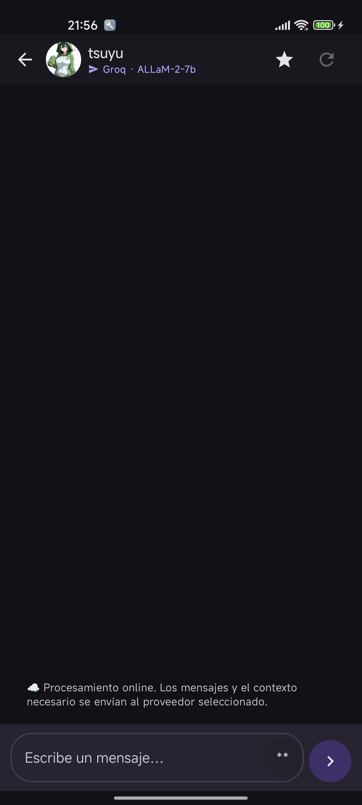
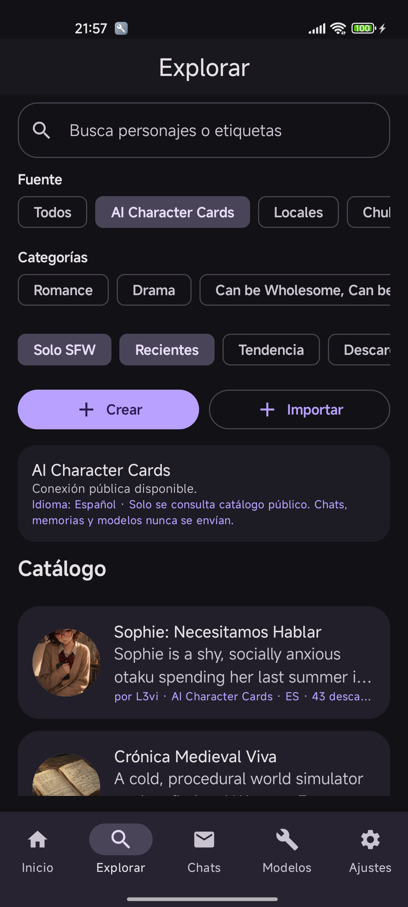
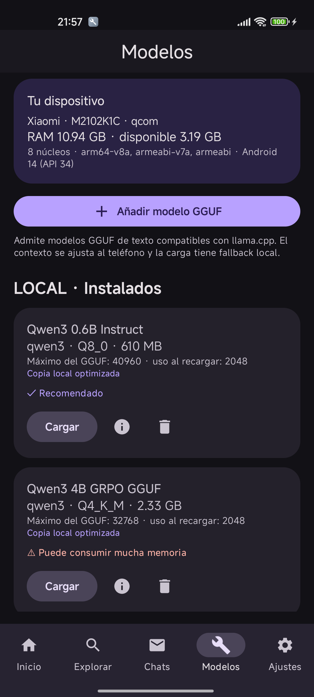
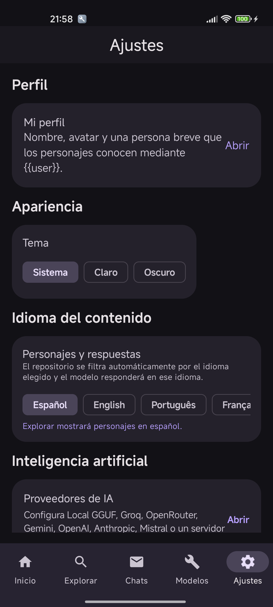
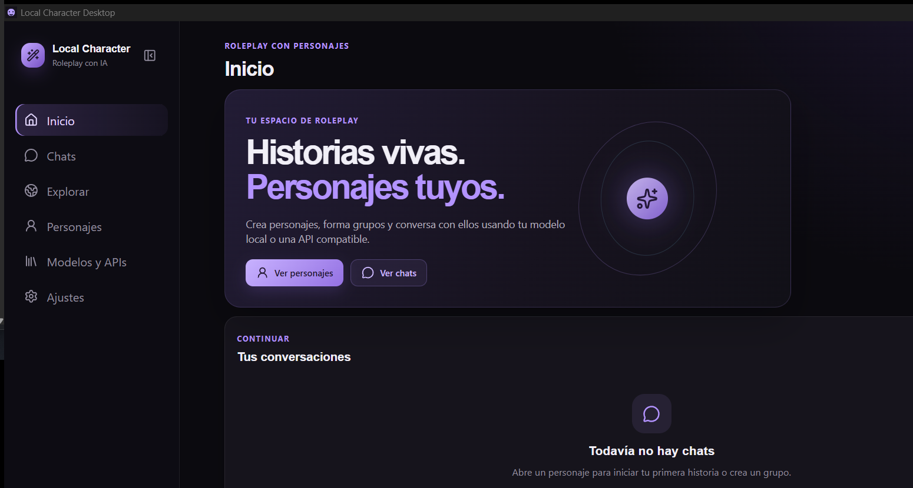
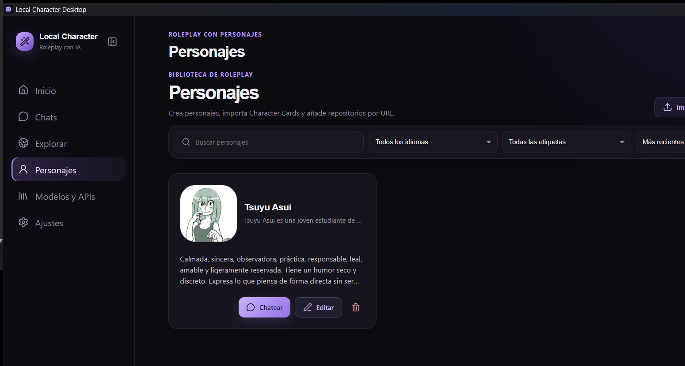
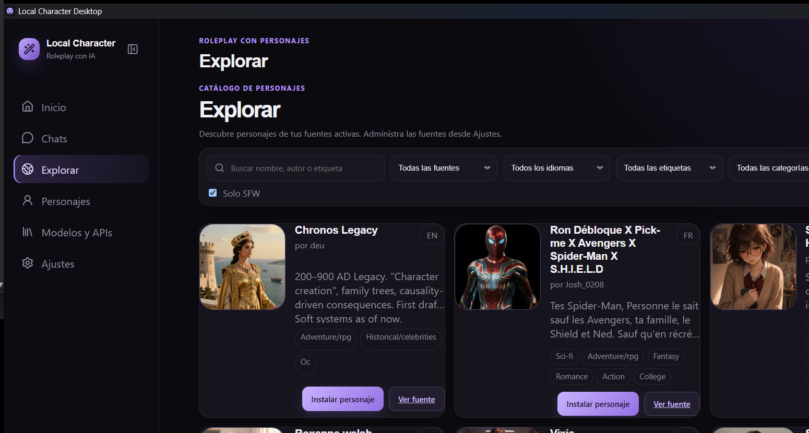
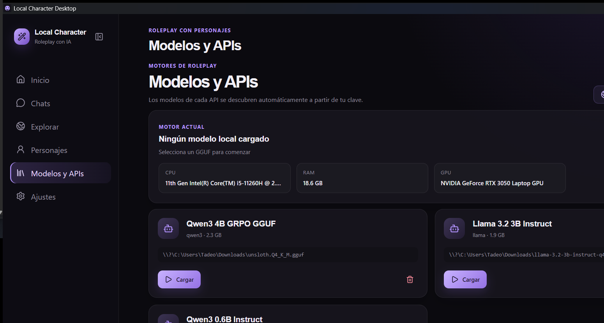
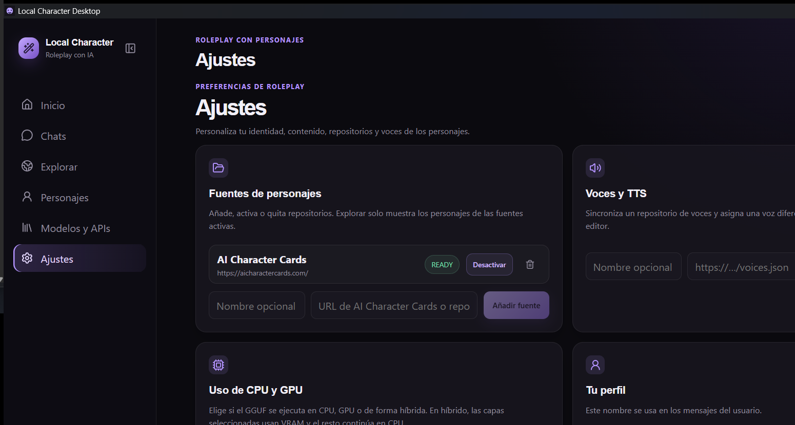

# Capturas de Local Character

Las imágenes están separadas por plataforma para que la página del proyecto muestre claramente la experiencia móvil y la versión Desktop.

- `android/`: capturas de la aplicación Android probada en Xiaomi.
- `desktop/`: capturas de Local Character Desktop en Windows.

Las capturas son únicamente material visual de demostración; las conversaciones que aparecen se guardan localmente en cada dispositivo.

## Android · Xiaomi

## Desktop · Windows

